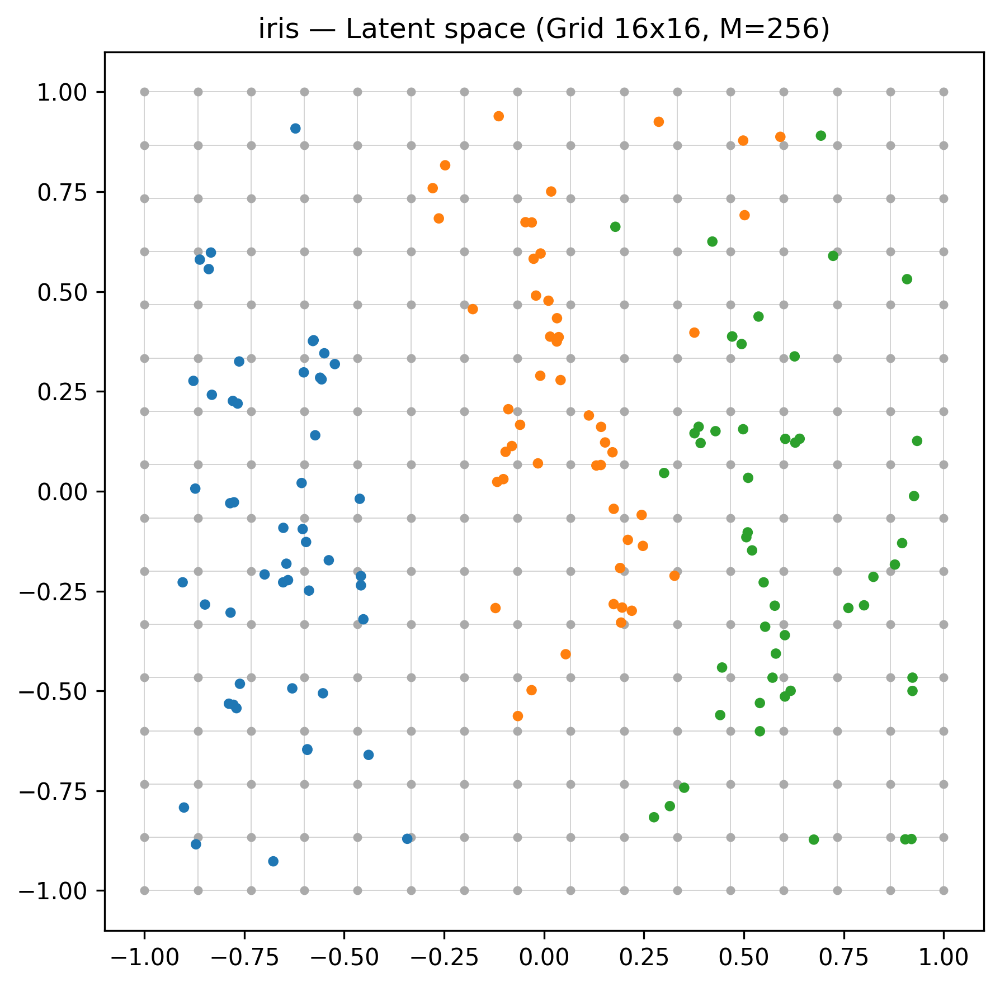
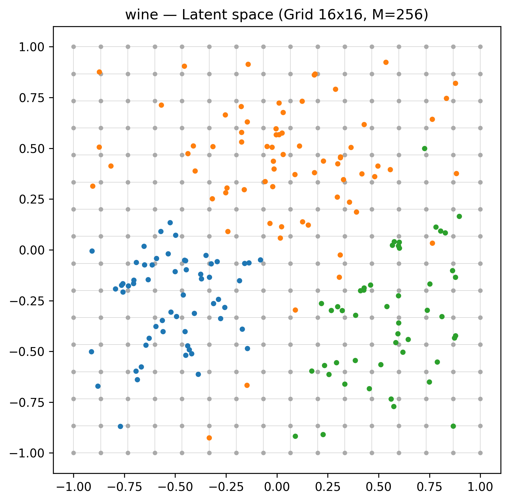
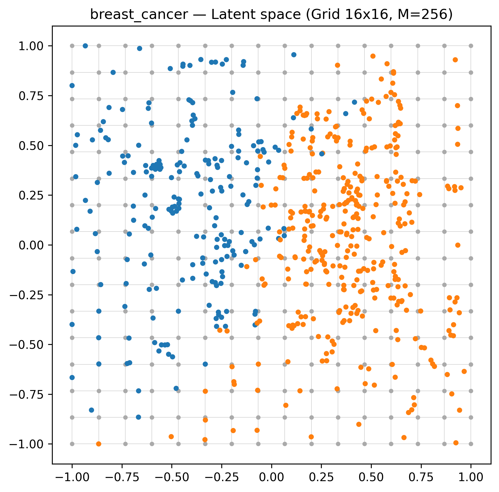
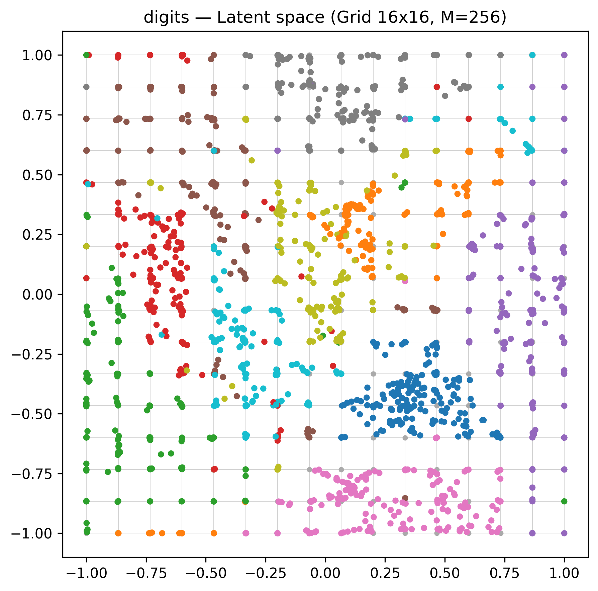
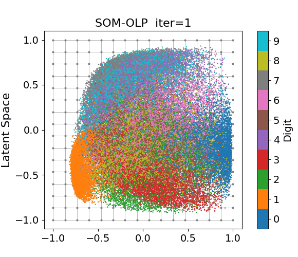

# SOM-OLP

Minimal Python implementation of **Self-Organizing Maps with Optimized Latent Positions (SOM-OLP)**.

## Overview

SOM-OLP is an objective-based SOM variant that jointly learns reference vectors and continuous latent positions for data points. This repository provides a minimal implementation with simple example scripts.

### Key features

- Single-objective formulation
- Closed-form cyclic block updates with a monotonically non-increasing objective
- O(NM) per iteration, where N is the number of data points and M is the number of nodes
- Related to entropy-regularized fuzzy c-means and k-means in limiting cases

## Installation

Clone this repository and install the required dependencies.

```bash
git clone https://github.com/subukata/som-olp.git
cd som-olp
pip install -r requirements.txt
```

Optuna is optional and required only for hyperparameter search.

```bash
pip install optuna
```

## Quick start

A minimal example is shown below. The hyperparameters `gamma` and `lam` are dataset-dependent; the values below were tuned for Iris via Optuna (see `experiments/optuna_hyperparameter_search.py`).

```python
import numpy as np
from sklearn.datasets import load_iris
from sklearn.preprocessing import StandardScaler

from somolp import SOMOLP

X, _ = load_iris(return_X_y=True)
X = StandardScaler().fit_transform(X)

# Create fixed node coordinates in the latent space
m_side = 16
t = np.linspace(-1, 1, m_side)
gx, gy = np.meshgrid(t, t)
R = np.column_stack([gx.ravel(), gy.ravel()])

# Initialize and fit the SOM-OLP model
model = SOMOLP(R, gamma=51.94, lam=1.32).fit(X)

print("n_iter =", model.n_iter)
print("final objective =", model.history[-1])
print("V (latent positions, first 5) =\n", model.V[:5])
print("W (reference vectors, first 5) =\n", model.W[:5])
```

## Example scripts

`experiments/example.py` runs SOM-OLP on Iris, Wine, Breast Cancer, and Digits (all from scikit-learn) using Optuna-tuned hyperparameters, and saves latent-space visualizations as PNG files to `experiments/results/`.

```bash
python experiments/example.py
```

`experiments/optuna_hyperparameter_search.py` searches for the best `gamma` and `lam` per dataset by maximizing the average of trustworthiness and continuity.

```bash
python experiments/optuna_hyperparameter_search.py
```

## Example results

The following figures show the learned latent representations produced by `experiments/example.py`.

Each figure shows the learned latent space on a 16×16 grid (`M=256`). Gray dots and lines represent the predefined latent-node grid, while colored points represent the learned continuous latent positions of the data points.

### Iris


### Wine


### Breast Cancer


### Digits


## MNIST example

The animation below shows the evolution of the learned latent representation on MNIST.
The model was tuned on 2,000 samples after normalization to [0, 1], and the final hyperparameters were then used to fit and visualize 70,000 samples.



## Citation

If you use this software, please cite the Zenodo record:

- https://doi.org/10.5281/zenodo.19547951

```bibtex
@software{ubukata2026somolp,
  author    = {Ubukata, Seiki},
  title     = {{SOM-OLP}},
  year      = {2026},
  publisher = {Zenodo},
  doi       = {10.5281/zenodo.19547951},
  url       = {https://github.com/subukata/som-olp}
}
```

Citation information is also available in `CITATION.cff`.

## License

This project is released under the MIT License. See `LICENSE` for details.
